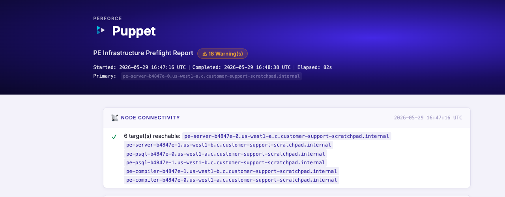
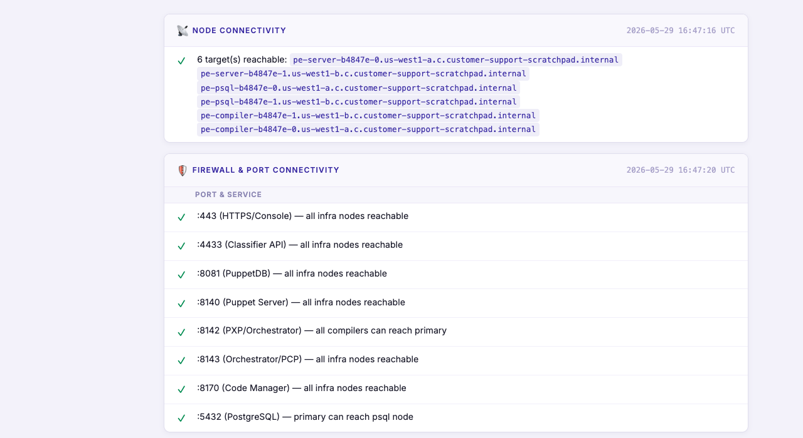
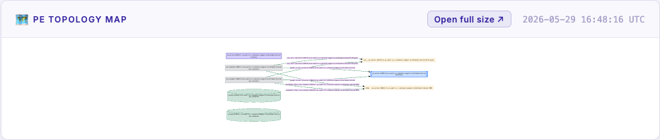

# peadm_preflight

A Bolt plan module that validates Puppet Enterprise infrastructure before a
[`peadm`](https://github.com/puppetlabs/puppetlabs-peadm) install or upgrade. It runs a
comprehensive set of checks across all PE infrastructure roles and produces both a
console summary and an interactive HTML report.

## Example report





## PE Topology Map

The report includes a live Mermaid flowchart showing how each infrastructure node is
connected. Edges are coloured **green** when the configuration is aligned and
**red/dashed** when drift is detected. Click **Open full size ↗** to render the diagram
full-page in a new browser tab.



## Checks performed

| Category | What is checked |
|---|---|
| **Node connectivity** | All targets reachable via Bolt |
| **Firewall / ports** | 443, 4433, 8081, 8140, 8142, 8143, 8170, 5432 from each infra role |
| **Disk space** | ≥ 100 GB on primary/psql nodes, ≥ 50 GB on compilers/replica |
| **Memory** | ≥ 8 GB available on primary, ≥ 4 GB elsewhere |
| **Service health** | `puppet infra status` + `pxp-agent` systemd state on compilers |
| **PE services per node** | All `pe-*` and `pxp-*` systemd units listed with active/failed state |
| **Log errors** | Last 500 lines of each PE service log scanned for ERROR/FATAL |
| **Database connectivity** | PE primary → PostgreSQL reachability |
| **Database performance** | Disk throughput and I/O wait on PE-PostgreSQL nodes |
| **Broker & config drift** | Compiler/replica `pxp-agent.conf`, `puppet.conf`, `puppetdb.conf` validated against primary |
| **Topology map** | Interactive Mermaid diagram of the full PE topology |

## Usage

### Auto-discover topology from primary

```bash
bolt plan run peadm_preflight::check_auto \
  primary_host=<primary-certname> \
  html_report_file=./preflight-report.html
```

This calls `peadm::get_peadm_config` on the primary to discover all infrastructure nodes
automatically, then runs `peadm_preflight::check`.

### Explicit topology

```bash
bolt plan run peadm_preflight::check \
  primary_host=pe-server-0.example.com \
  replica_host=pe-server-1.example.com \
  compiler_hosts=pe-compiler-0.example.com,pe-compiler-1.example.com \
  primary_postgresql_host=pe-psql-0.example.com \
  replica_postgresql_host=pe-psql-1.example.com \
  html_report_file=./preflight-report.html
```

### Topology map only

```bash
bolt plan run peadm_preflight::topology_map \
  primary_host=<primary-certname>
```

Runs only the broker/config probes and prints the Mermaid diagram to the console.

## Parameters — `peadm_preflight::check`

| Parameter | Type | Default | Description |
|---|---|---|---|
| `primary_host` | `Optional[String]` | — | Certname of the PE primary |
| `replica_host` | `Optional[String]` | — | Certname of the HA replica |
| `compiler_hosts` | `Optional[String]` | — | Comma-separated list of compiler certnames |
| `primary_postgresql_host` | `Optional[String]` | — | PE-PostgreSQL primary (XL only) |
| `replica_postgresql_host` | `Optional[String]` | — | PE-PostgreSQL replica (XL only) |
| `version` | `Optional[String]` | — | Target PE version (validated against supported list) |
| `token_file` | `Optional[String]` | — | Path to a PE RBAC token file |
| `pe_admin_password` | `Optional[String]` | — | PE admin password (generates token at runtime) |
| `token_lifetime` | `String` | `1h` | Lifetime for a generated RBAC token |
| `permit_unsafe_versions` | `Boolean` | `false` | Suppress errors for unsupported PE versions |
| `html_report_file` | `Optional[String]` | — | Path to write the HTML report (prompted if omitted) |

## Installation

Add to your `Puppetfile`:

```ruby
mod 'peadm_preflight',
  git: 'https://github.com/cwebster61083/peadm_preflight.git',
  branch: 'main'
```

Then install:

```bash
bolt module install
```

## Module structure

```
peadm_preflight/
├── plans/
│   ├── check.pp            # Main preflight plan
│   ├── check_auto.pp       # Auto-discovers topology via peadm::get_peadm_config
│   ├── topology_map.pp     # Standalone topology map plan
│   └── ...
├── tasks/
│   ├── get_agent_broker.*  # Reads pxp-agent.conf broker_uris
│   ├── get_puppet_conf.*   # Parses puppet.conf server/certname settings
│   └── get_puppetdb_conf.* # Reads puppetdb.conf server_urls
├── functions/
│   ├── db_connectivity.pp  # Database connectivity checks
│   ├── db_performance.pp   # Database I/O performance checks
│   ├── mermaid_id.pp       # Converts certnames to Mermaid-safe IDs
│   └── render_mermaid.pp   # Builds Mermaid flowchart from topology model
└── metadata.json
```

## Requirements

- Puppet Bolt ≥ 3.0.0
- Puppet Enterprise ≥ 2021.x
- The [`puppetlabs-peadm`](https://github.com/puppetlabs/puppetlabs-peadm) module (for `check_auto` and `topology_map`)

## License

Apache License 2.0
